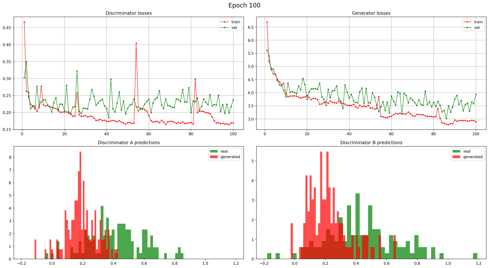
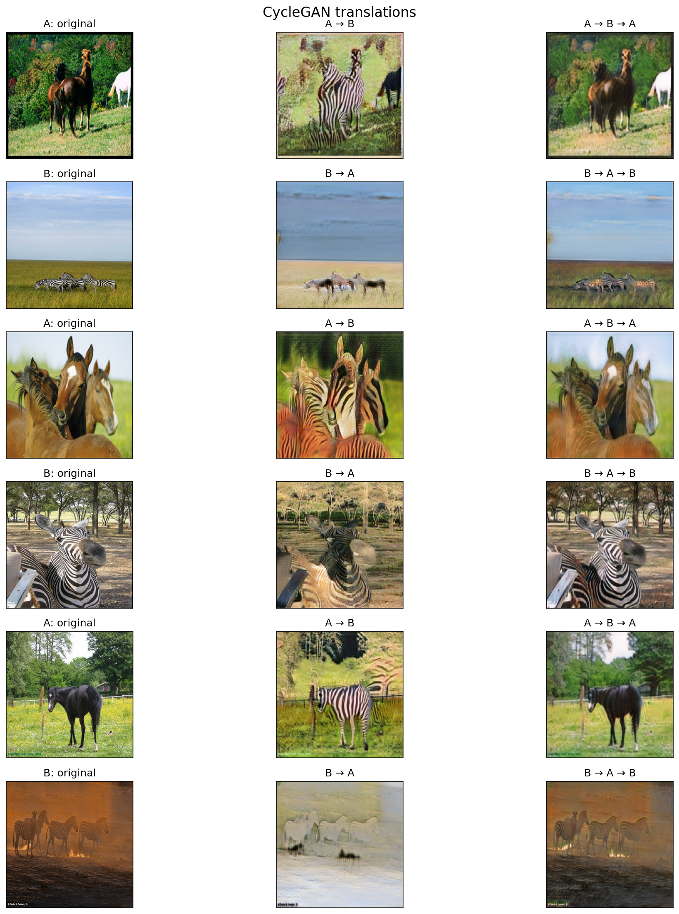
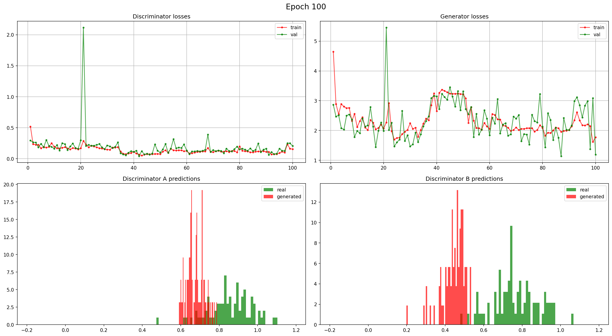
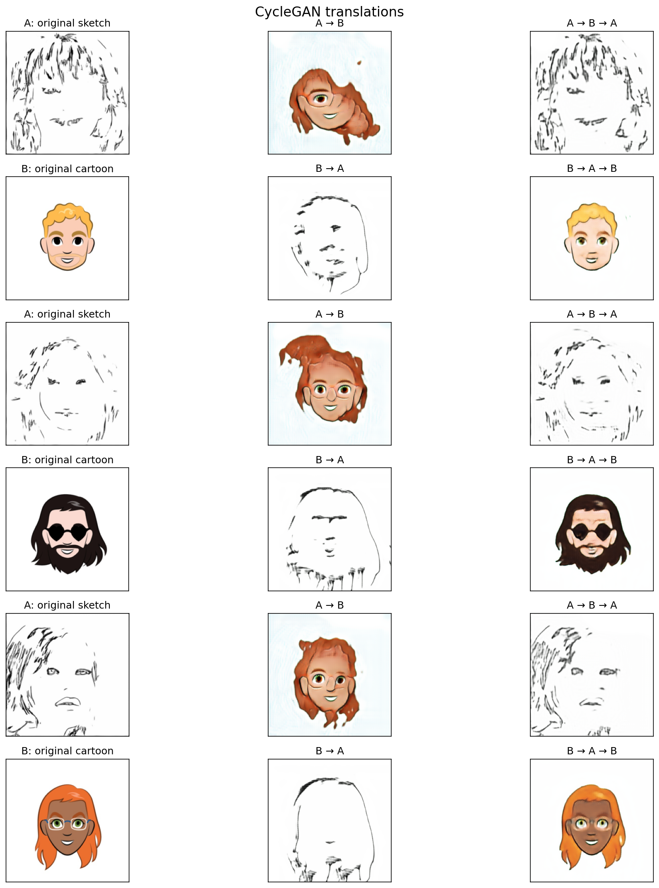

# CycleGAN: преобразование между двумя визуальными доменами

В проекте используется **CycleGAN** — модель для **непарного image-to-image translation**. Она обучается на двух независимых наборах изображений и не требует точных пар вида «вход–цель». Архитектура включает два генератора и два дискриминатора:

- `G_AB`: преобразует изображения из домена **A** в домен **B**;
- `G_BA`: преобразует изображения из домена **B** в домен **A**;
- `D_A` и `D_B`: отличают реальные изображения домена от сгенерированных.

Обучение основано на двух типах потерь:

- **adversarial loss** — заставляет генераторы делать изображения похожими на целевой домен;
- **cycle consistency loss** — требует, чтобы после двойного преобразования изображение сохраняло своё содержание: `A → B → A` и `B → A → B`.

Таким образом, модель учится менять стиль и внешний вид изображения, не имея парных примеров.

## Веб-интерфейс

Веб-версия приложения: https://huggingface.co/spaces/BlackBoarder/my_cyclegan

---

## Задача 1. Лошади ↔ зебры

Преобразование изображений **лошадей** в **зебр** и обратно.

- **Домен A:** фотографии лошадей
- **Домен B:** фотографии зебр

Эта задача хорошо подходит для CycleGAN, потому что в ней меняется прежде всего внешний стиль объекта, а геометрия сцены остаётся в целом похожей.

### Кривые обучения и распределения предсказаний дискриминаторов:

### Примеры преобразований модели:

---

## Задача 2. Карандашные портреты ↔ цветные рисованные лица

Вторая задача — преобразование между двумя доменами лицевых изображений:

- **Домен A:** карандашные скетчи лиц из датасета [Person Face Sketches](https://www.kaggle.com/datasets/almightyj/person-face-sketches);
- **Домен B:** цветные рисованные лица из [Cartoon Faces / CartoonSet](https://www.kaggle.com/datasets/brendanartley/cartoon-faces-googles-cartoon-set).

Тут модель показала себя довольно плохо, видимо потому что скетчи нарисованы по большей части очень небрежно, а мультяшные лица все симметричные.

### Кривые обучения и распределения предсказаний дискриминаторов:

### Примеры преобразований модели:

---

## Используемые скрипты

- `model.py` — архитектура CycleGAN, функции потерь и вспомогательные компоненты;
- `horse2zebra.ipynb` — исходный ноутбук всё вплоть до обучения модели;
- `train_horse2zebra.py` — обучение модели на задаче **horse2zebra**;
- `train_face.py` — обучение модели на задаче **sketch2cartoon_faces**;
- `app.py` — интерактивное приложение для загрузки изображений и показа преобразований модели.
